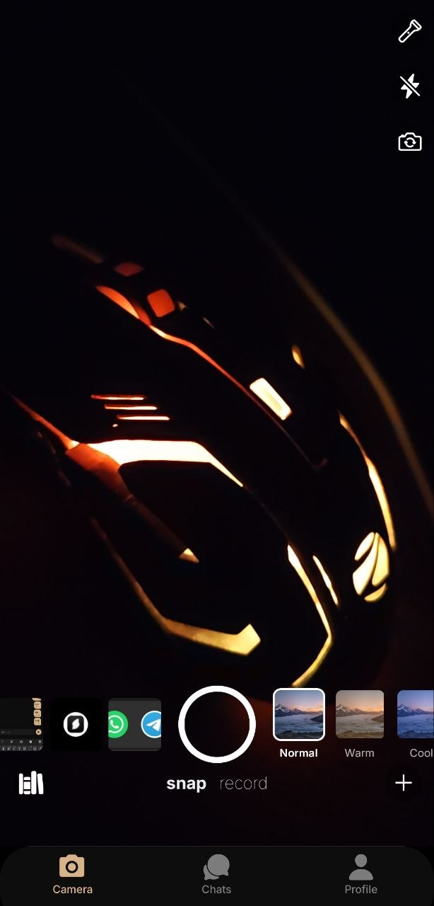
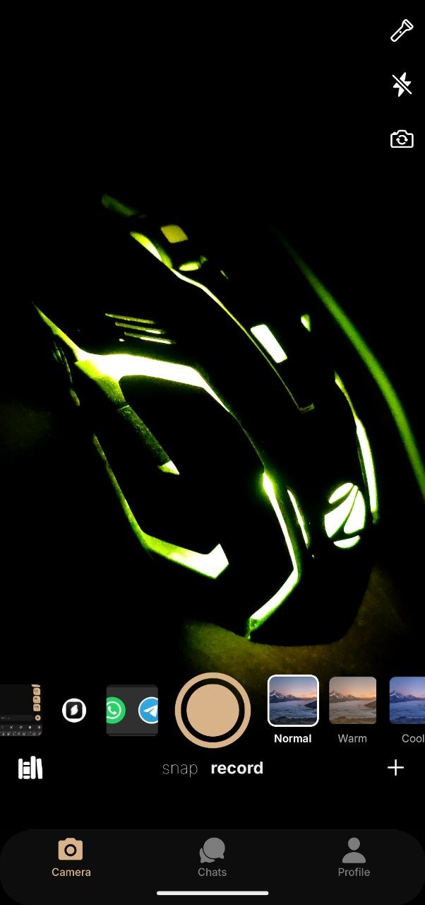
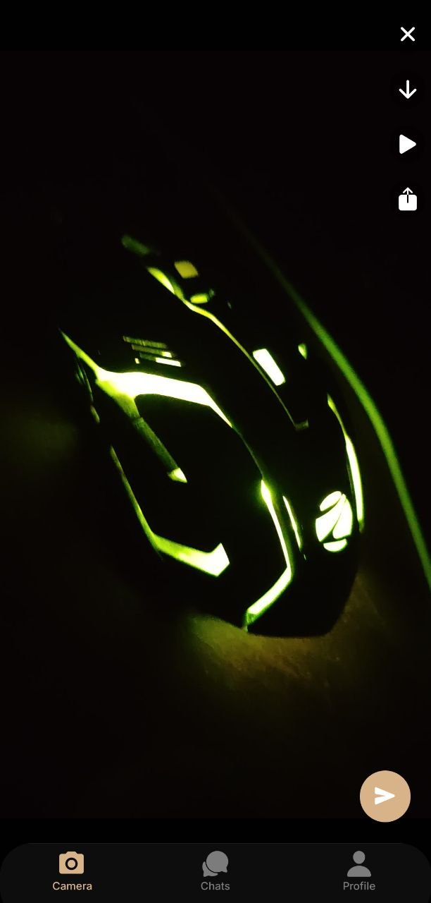
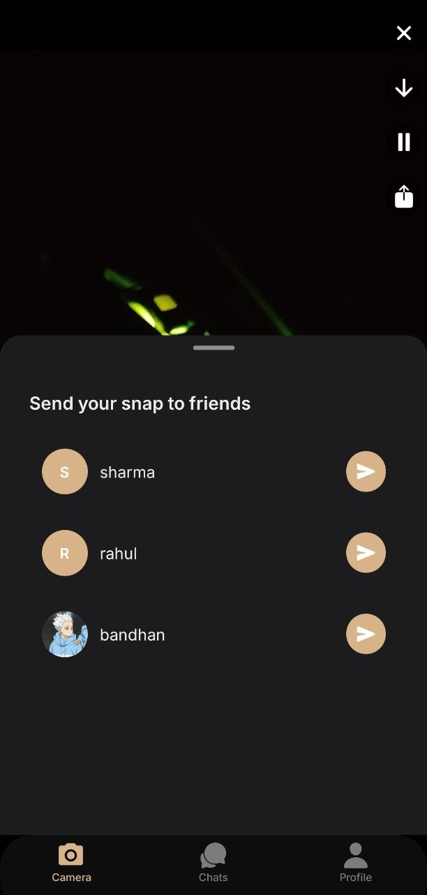
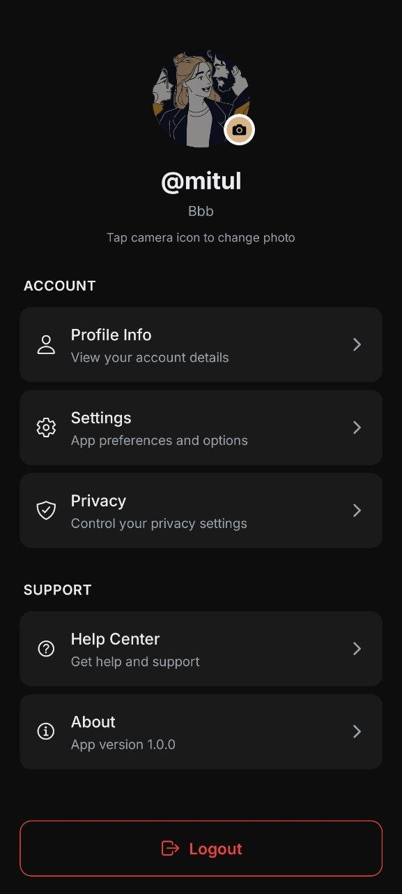
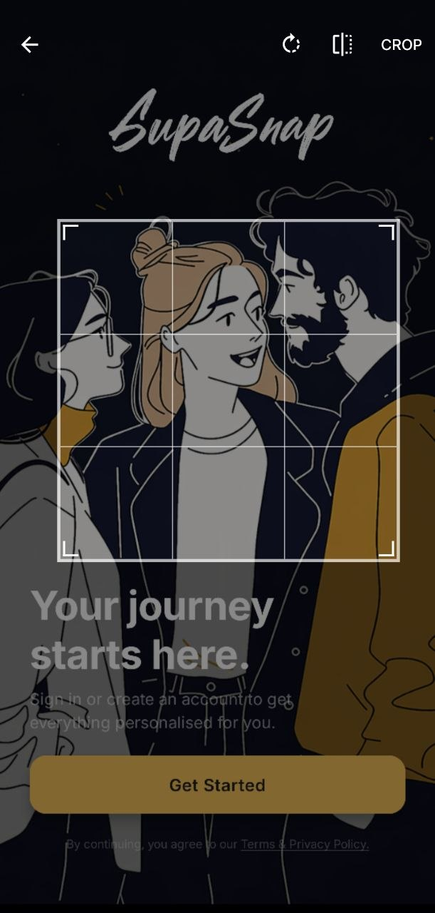

### App Icon

<div align="center">  <h3>SupaSnap</h3> <p> A snap-sharing app built with Expo (React Native) and Supabase.<br/> Capture photos/videos with filters and share instantly with friends.<br/> Supports i18n based on device language. </p> </div>

### App Demo
<div align="center"> 

<br/>

#### note: demo is also available [here](https://www.bandhanmajumder.com/) at the projects preview section

 </div>

## Screens

### Auth & Onboarding screen

<div align="center">     </div>

### Camera & Sharing

<div align="center">     </div>

### Chat

<div align="center">     </div>

### Profile screen

<div align="center">   </div>

## Get started

1. Install dependencies

   ```bash
   yarn install
   ```
2. Setup .env.local

   ```bash
   cp .env.example .env.local
   ```

3. Setup supabase locally and setup the credentials (reference: see [docs](https://supabase.com/docs/guides/local-development/cli/getting-started))

4. Reset the db

```bash
supabase db reset
```

5. Edit the `messages` table to support realtime via the UI

6. Start the app

   ```bash
   npx expo start

   # or

   yarn android
   ```