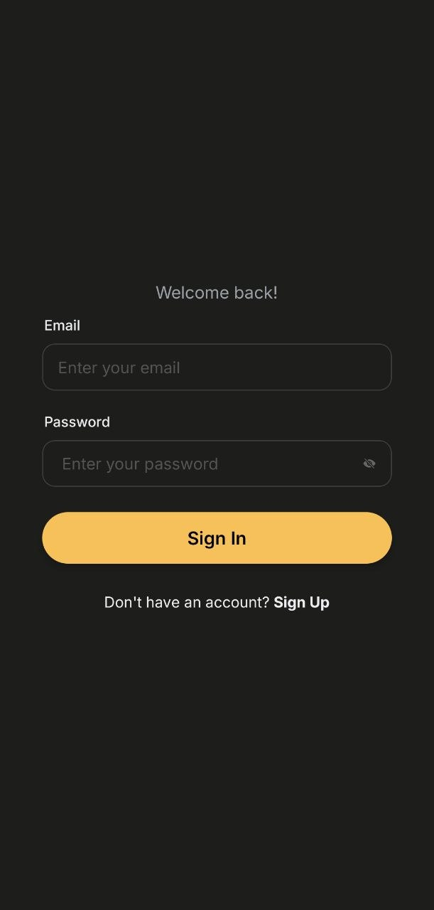
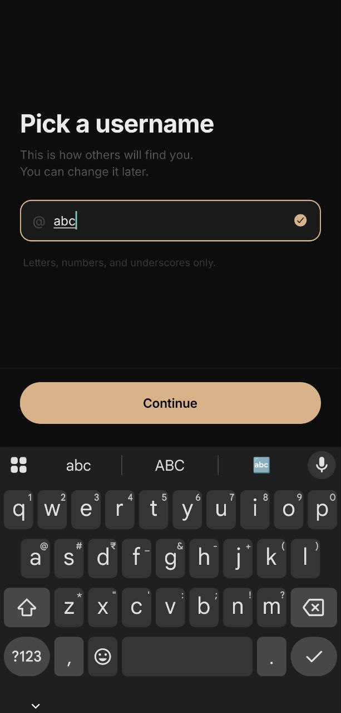
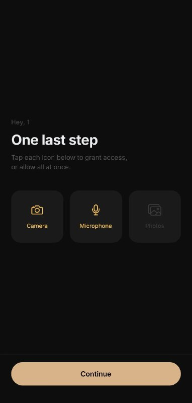
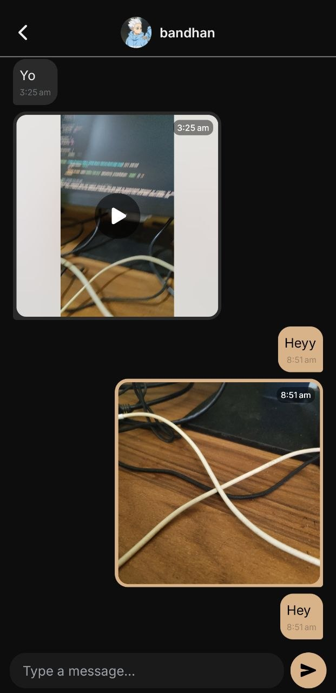
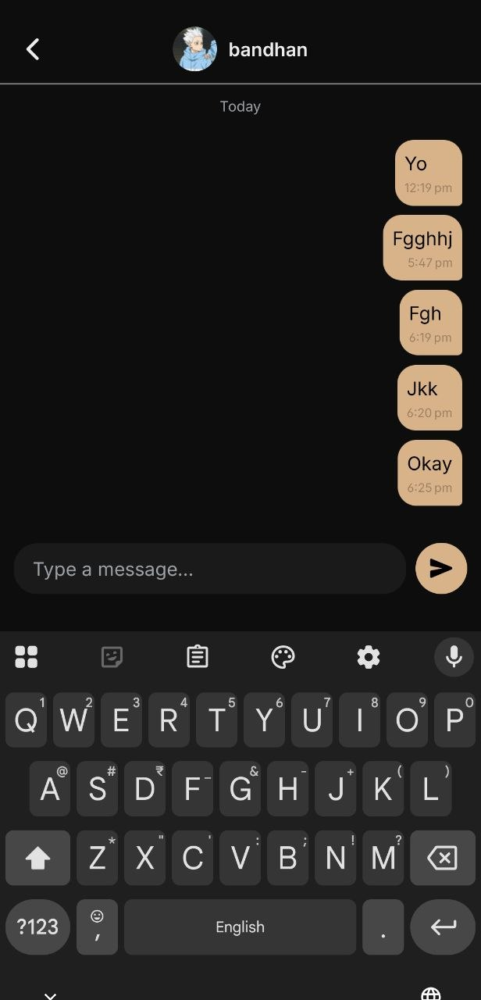
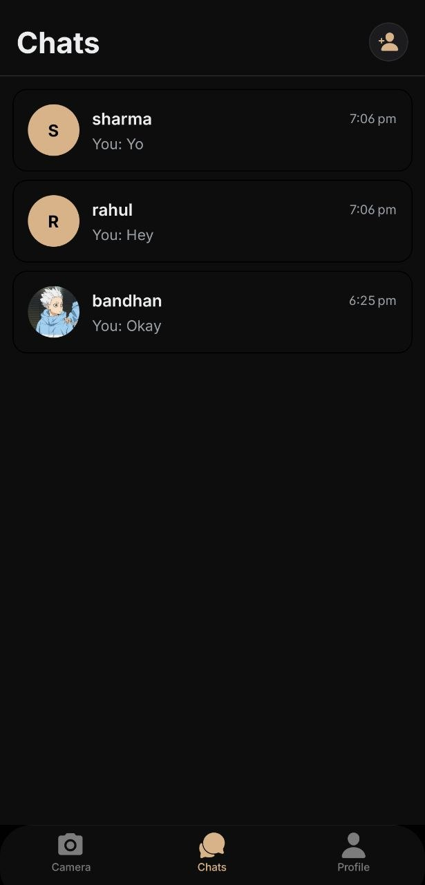
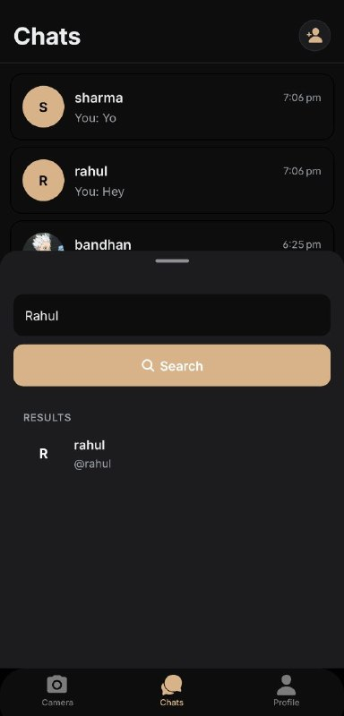

### App Icon

<div align="center">
  
  <h3>Welcome to SupaSnap!</h3>
  <p>SupaSnap is a snap sharing application built on top of Expo (React Native) and Supabase. It allows to share snap to friends with native camera with filters available. Both image and video types are available to record and share. It also have i18n support which works based on the device's language.</p>
</div>

## Screens

### Auth & Onboarding screen

<div align="center">
  
  
   
  
</div>


### Chat screen

<div align="center">
  
  
  
  
</div>

## Get started

1. Install dependencies

   ```bash
   yarn install
   ```
2. Setup .env.local

   ```bash
   cp .env.example .env.local
   ```

3. Setup supabase locally and setup the credentials (reference: see [docs](https://supabase.com/docs/guides/local-development/cli/getting-started))

4. Start the app

   ```bash
   npx expo start

   # or

   yarn android
   ```